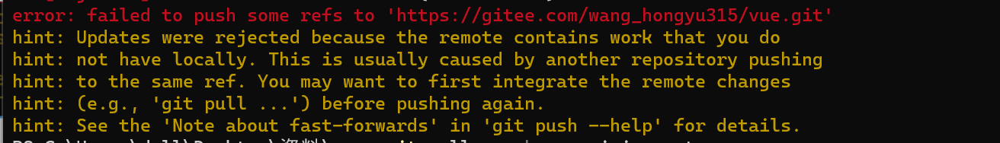

1、 Can't find Python executable "python", you can set the PYTHON env variable.

（1）运行环境安装:

```js
npm install --global --production windows-build-tools
```

（2）安装python运行环境(2.7版本)：

```tex
安装2.7版本python
```

2、vue3中使用required 报错：

```js
eslintrc.js
module.exports = {
    ...
    rules:{
        '@typrscript-eslint/no-var-requeires':0
    }
}
```

3、git warning: LF will be replaced by CRLF in package.json

```js
git config core.autocrlf false 
```

4、全局配置scss变量 ；loaderOptions中是需要配置的预编译选项

```js
module.exports = {
  css: {
    loaderOptions: {
      scss: {
        prependData: '@import "./src/style/common.scss";'
      }
    }
  }
}
```
5、
```js
git pull --rebase origin master
然后执行git push
```

6、node 版本管理

```js
github 查找 nvm-windows  下载 nvm-setup.zip（稳定版）一键安装 
查看nvm安装是否成功
输入 nvm
nvm install xxx（指定版本）
nvm use xxx(指定版本)将node版本切换到指定版本
```

7、vue-router 搜索框重复点击，爆红

重写vue-router得push 和replace方法，在router中index.js

```js
let originPush = VueRouter.prototype.push
VueRouter.prototype.push = function (location, resolve, reject) {
  if (resolve && reject) {
    originPush.call(this, location, resolve, reject)
  } else {
    originPush.call(
      this,
      location,
      () => {},
      () => {}
    )
  }
}
let originReplace = VueRouter.prototype.replace
VueRouter.prototype.replace = function (location, resolve, reject) {
  if (resolve && reject) {
    originReplace.call(this, location, resolve, reject)
  } else {
    originReplace.call(
      this,
      location,
      () => {},
      () => {}
    )
  }
}
```

npm install 以后 出现package.json版本变更问题
npm install --no-save